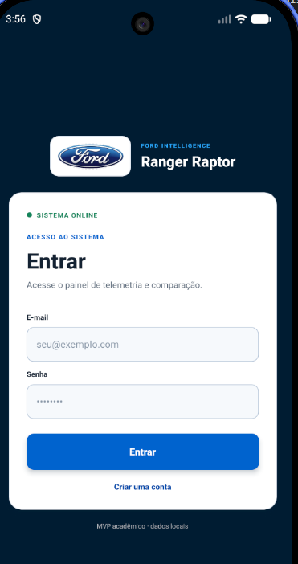
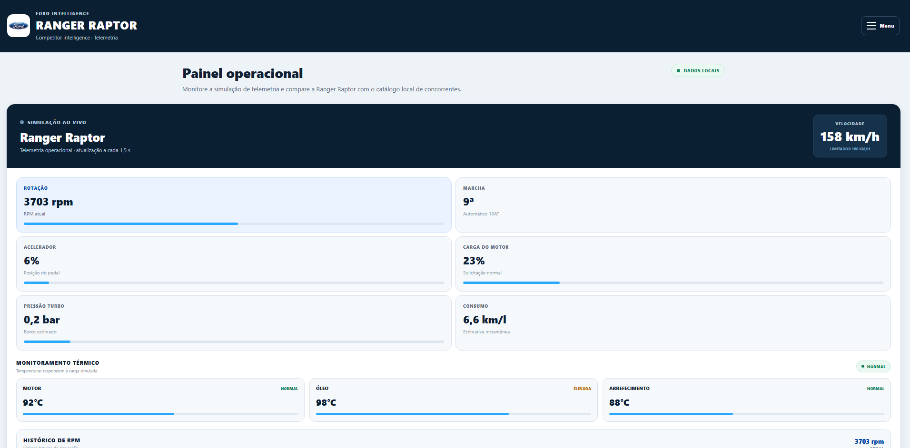
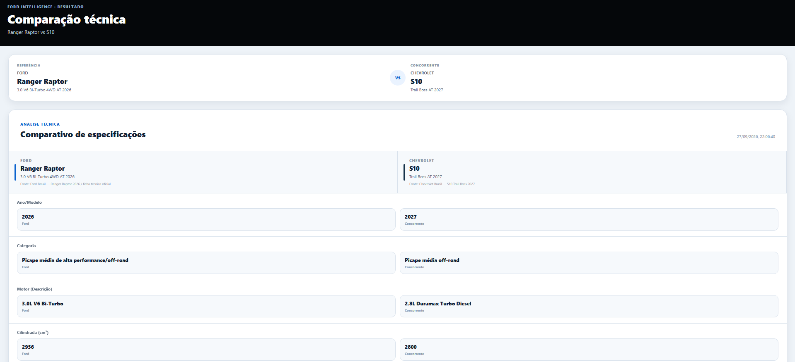

# Ford Ranger Raptor — Competitor Intelligence

Aplicativo acadêmico desenvolvido em React Native + Expo para apresentar a **telemetria simulada da Ford Ranger Raptor** e realizar **comparações técnicas com um catálogo local de picapes concorrentes**.

> **Login administrativo:** use `admin@ford.com` com a senha `admin123` para entrar no usuário administrador do MVP local.

## Demonstração visual

### Login



### Dashboard e telemetria



### Comparação técnica



### GIFs de demonstração

#### Fluxo de login


#### Telemetria ao vivo


> A captura enviada para esta documentação como `sprint.gif` era, tecnicamente, uma imagem PNG estática. Para garantir que o GitHub interprete o arquivo corretamente, ela foi armazenada como `docs/media/login.png`.

## O que o projeto entrega

- **Dashboard operacional** com telemetria simulada da Ranger Raptor.
- **Monitoramento detalhado** de velocidade, RPM, acelerador, carga do motor, marcha, temperaturas, turbo e consumo.
- **Comparação técnica** entre a Ranger Raptor e veículos do catálogo local.
- **Busca por marca, modelo e versão**, com validação e mensagens para resultados inexistentes.
- **Menu lateral** com navegação entre Dashboard, Monitoramento, Comparação, Ranger Raptor, Relatório e Sobre.
- **Ficha técnica completa** da Ranger Raptor.
- **Relatório técnico** com leitura da telemetria atual.
- **Persistência local** de sessão e dados de comparação com AsyncStorage.
- **Interface corporativa responsiva**, pensada para web, Android e teste com Expo Go.
- **Arquitetura local-first**: nenhuma API da Ford é necessária durante a execução do MVP.

## Telas principais

| Rota | Tela | Função |
|---|---|---|
| `/login` | Login | Autenticação local |
| `/signup` | Cadastro | Criação de usuário local |
| `/` | Dashboard | Painel operacional e telemetria |
| `/monitoring` | Monitoramento | Telemetria detalhada em tempo real simulado |
| `/comparison` | Comparação | Comparativo técnico Raptor × concorrente |
| `/details` | Ranger Raptor | Ficha técnica consolidada |
| `/report` | Relatório | Resumo técnico e leitura da telemetria |
| `/about` | Sobre | Informações do projeto e da arquitetura |

## Stack

O projeto utiliza a seguinte base de dependências:

| Tecnologia | Versão |
|---|---|
| Expo | `~57.0.23` |
| React Native | `0.86.3` |
| React | `19.2.3` |
| Expo Router | `~57.0.23` |
| TypeScript | `~6.0.3` |
| AsyncStorage | `2.2.0` |
| Node.js | `22.13+` |

## Pré-requisitos

- Node.js `22.13+`
- npm
- Conta Expo/EAS para gerar builds
- Expo Go para testes rápidos no celular
- Android Studio para desenvolvimento/emulador Android

## Instalação

Clone o repositório e entre na pasta do projeto:

```bash
git clone https://github.com/OTAVIO48FERRAO/fiap-mdi-sprint-ford-compare.git
cd fiap-mdi-sprint-ford-compare
```

Instale as dependências:

```bash
npm install
```

Depois, execute o projeto em modo de desenvolvimento:

```bash
npx expo start
```

Para testar no celular, abra o **Expo Go** e escaneie o QR Code apresentado pelo Expo. Em condições normais, computador e celular devem estar na mesma rede Wi-Fi.

## Login local

O MVP possui um usuário administrativo padrão em `mock/users.ts`:

```text
E-mail: admin@ford.com
Senha: admin123
Perfil: admin
```

As credenciais são apenas para demonstração acadêmica. As senhas são armazenadas localmente em texto claro e **não devem ser utilizadas em produção**.

Também é possível criar novos usuários pela tela de cadastro; os dados ficam no armazenamento local do dispositivo.

## Gerar APK

O projeto possui um perfil `preview` configurado no `eas.json` para gerar um **APK instalável**.

Faça login no EAS:

```bash
npx eas-cli@latest login
```

Caso seja o primeiro build deste projeto no EAS, inicialize o projeto:

```bash
npx eas-cli@latest init
```

Gere o APK:

```bash
npx eas-cli@latest build -p android --profile preview
```

Ao final, o EAS disponibiliza a página da build e o link de instalação/download do APK.

## Android local / Android Studio

Para gerar os arquivos nativos localmente:

```bash
npx expo prebuild
```

Depois execute:

```bash
npx expo run:android
```

O diretório `android/` é gerado pelo Expo e não é necessário versioná-lo quando o projeto é trabalhado com prebuild/CNG.

## Arquitetura

A aplicação utiliza uma abordagem **local-first**.

```text
app/
├── _layout.tsx        # Layout raiz, providers e navegação
├── login.tsx          # Login local
├── signup.tsx         # Cadastro local
├── index.tsx          # Dashboard
├── monitoring.tsx     # Monitoramento da telemetria
├── comparison.tsx    # Comparação técnica
├── details.tsx        # Ficha técnica da Raptor
├── report.tsx         # Relatório técnico
└── about.tsx          # Sobre o projeto

components/
├── ComparisonTable.tsx
├── SideMenu.tsx
└── TelemetryCard.tsx

context/
└── ComparisonContext.tsx

mock/
├── fordData.ts
├── aiResponseData.ts  # catálogo local; nome legado do MVP
└── users.ts

constants/
└── theme.ts

types/
└── index.ts

utils/
└── dataFormatter.ts

docs/
└── media/
    ├── login.png
    ├── dashboard.png
    ├── comparison.png
    ├── login-demo.gif
    └── telemetry-demo.gif
```

## Dados e telemetria

Os dados técnicos são mantidos em `mock/` e a telemetria da Ranger Raptor é simulada localmente. A atualização do painel ocorre de forma periódica para representar atividade do veículo sem depender de uma API externa.

O arquivo `mock/aiResponseData.ts` mantém o nome legado do MVP, mas **não realiza chamadas para uma IA ou para uma API em runtime**. Ele funciona como catálogo local e fornece a busca dos concorrentes utilizados na comparação.

## Catálogo de veículos

O catálogo local inclui, entre outros:

- Ford Ranger Raptor
- Toyota Hilux SRX Plus
- Chevrolet S10 Trail Boss
- Volkswagen Amarok V6
- Nissan Frontier PRO-4X
- Mitsubishi Triton Katana
- RAM 1500 / RAM 2500 como referências full-size

A tabela de comparação evita inventar campos que não estejam disponíveis na ficha utilizada para a Ranger Raptor.

## Persistência local

O aplicativo utiliza **AsyncStorage** para manter:

- sessão do usuário;
- usuário atual;
- usuários cadastrados no MVP;
- estado da comparação quando aplicável.

Não existe banco de dados remoto nem backend obrigatório para executar a aplicação.

## Design

O sistema visual segue uma linguagem corporativa limpa:

- navy/preto para cabeçalhos e navegação;
- branco e cinzas claros para superfícies;
- azul para ações principais;
- verde, âmbar e vermelho para estados;
- cards com bordas discretas, sombras leves e cantos arredondados.

No Expo Web, a seleção de texto da interface é desabilitada para evitar o cursor de texto em elementos visuais, mantendo `TextInput` editável.

## Comandos principais

```bash
npm install
npx expo start
npx expo start --clear
npx expo prebuild
npx expo run:android
npx eas-cli@latest login
npx eas-cli@latest build -p android --profile preview
```

## Git — fluxo de atualização

Depois de alterar o projeto:

```bash
git status
git add .
git commit -m "descreva a alteração"
git push
```

O `package-lock.json` deve ser versionado quando for gerado/atualizado pelo `npm install`, para manter a instalação reproduzível.

## Checklist de validação

- [ ] `npm install` termina sem `ERESOLVE`.
- [ ] `npx expo start` abre o projeto.
- [ ] Login administrativo funciona com as credenciais locais documentadas.
- [ ] Cadastro local funciona.
- [ ] Dashboard exibe a telemetria simulada.
- [ ] Monitoramento mostra a evolução dos indicadores.
- [ ] Menu lateral navega entre as telas.
- [ ] Comparação carrega o catálogo sem API externa.
- [ ] Ficha técnica e relatório são exibidos corretamente.
- [ ] `npx eas-cli@latest build -p android --profile preview` gera o APK.

## Uso acadêmico

Projeto desenvolvido para entrega acadêmica. Os dados de veículos e a telemetria são utilizados para fins demonstrativos e não substituem as fichas técnicas oficiais das fabricantes.

## Equipe

- Gustavo Viega Martins Lopes — RM555885
- Gustavo Yuji Osugi — RM555034
- Kaio Drago Lima Souza — RM556095
- Otávio Santos de Lima Ferrão
- Vitor Rivas Cardoso — RM556404
